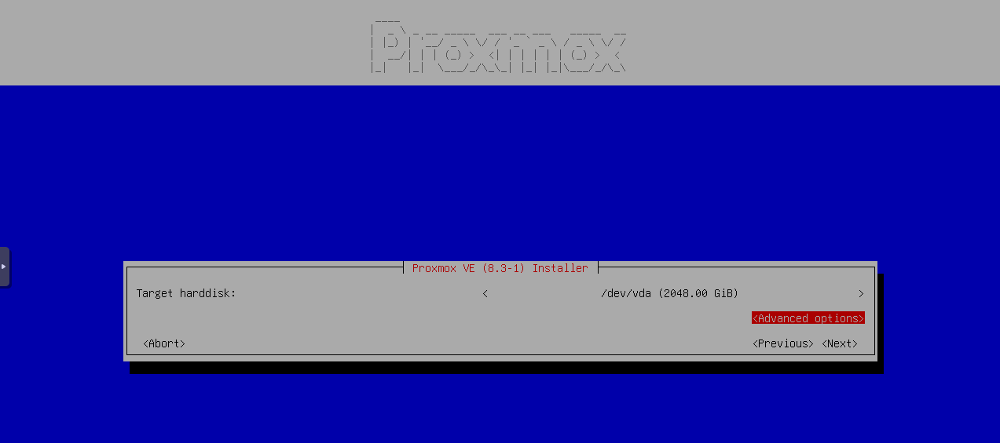
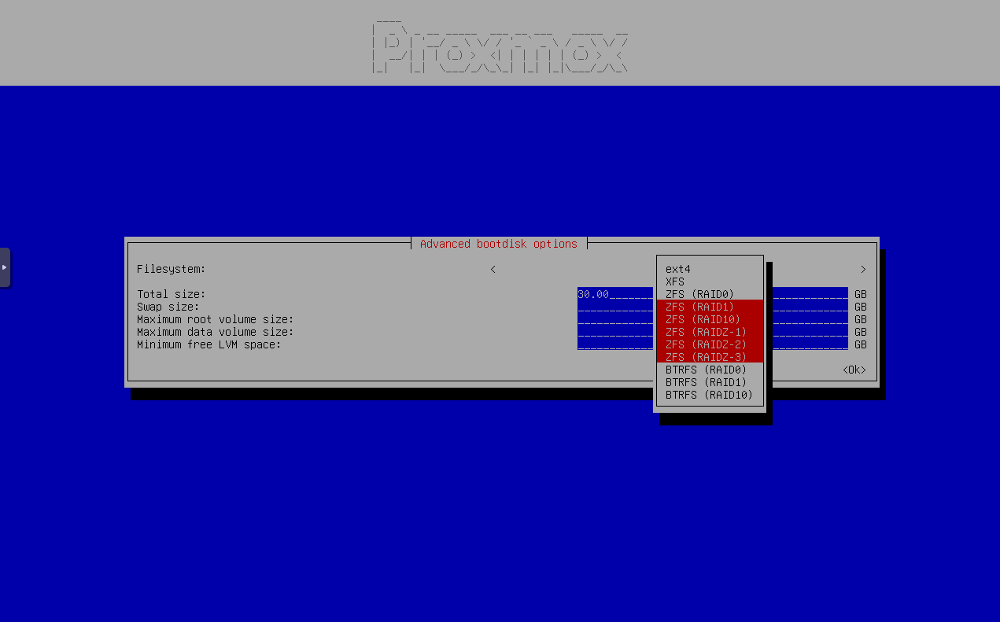
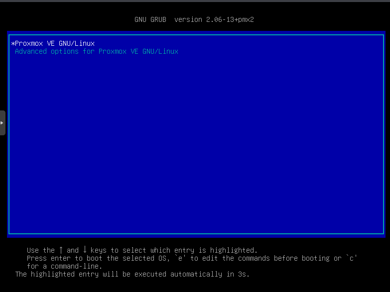
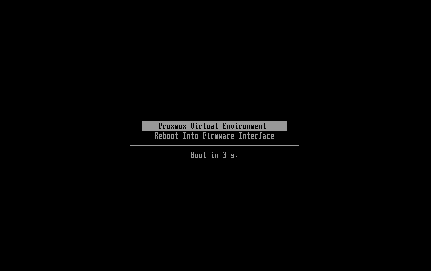

# HOW TO - Encrypt complete Proxmox VE node with LUKS

I was searching myself a way on how to get a full encrypted node, but found no step by step how to, so here it is.

**⚠️ NOTE:** I'm not responsible, if you break something. Make always sure to have a backup before you begin.

This how to works for an existing or fresh Proxmox VE installation, but currently needs a `ZFS (RAID0)`, `ZFS (RAID1)`, `ZFS (RAID10)`, `ZFS (RAIDZ-1)`, `ZFS (RAIDZ-2)`, `ZFS (RAIDZ-3)` filesystem. The how to for other filesystems and disk configurations will follow. You are welcome to help to add those steps :-)

Upvote the feature request [here](https://bugzilla.proxmox.com/show_bug.cgi?id=6160) to get LUKS configuration integrated in the Proxmox VE installer. For reference here is also the [Proxmox Forum](https://forum.proxmox.com/threads/feature-request-add-luks-to-installer.162036/) entry, but the upvotes are needed in the Proxmox Bugzilla instance.

If you already have LUKS configured, you can use this guide to make the system bootable again or add unlock options.

What this how to covers:

1. [Fresh installation](#fresh-installation)

   - [ZFS (RAID1), ZFS (RAID10), ZFS (RAIDZ-1), ZFS (RAIDZ-2), ZFS (RAIDZ-3)](#zfs-raid1-zfs-raid10-zfs-raidz-1-zfs-raidz-2-zfs-raidz-3)

2. [Things to check before starting](#things-to-check-before-starting)

   - [Boot loader](#boot-loader)
     - [GRUB](#grub)
     - [systemd-boot](#systemd-boot)
   - [Filesystem and disk configuration](#filesystem-and-disk-configuration)
     - [ZFS (RAID1), ZFS (RAID10), ZFS (RAIDZ-1), ZFS (RAIDZ-2), ZFS (RAIDZ-3)](#zfs-raid1-zfs-raid10-zfs-raidz-1-zfs-raidz-2-zfs-raidz-3-1)

3. [Backup data](#backup-data)
4. [Install requirements](#install-requirements)
5. [Enable LUKS for root partition](#enable-luks-for-root-partition)

   - [ZFS (RAID0/Single Disk)](#zfs-raid0single-disk)
   - [ZFS (RAID1), ZFS (RAID10), ZFS (RAIDZ-1), ZFS (RAIDZ-2), ZFS (RAIDZ-3)](#zfs-raid1-zfs-raid10-zfs-raidz-1-zfs-raidz-2-zfs-raidz-3-2)
     - Take offline one ZFS partition
     - Delete all data on the offline partition and create a LUKS (crypted) partition
     - Mount the crypted volume
     - Replace the old ZFS partition in the ZFS pool with the new empty crypted ZFS partition and wait for resilvering to complete
     - Repeat the same step for the other ZFS partition

6. [Fix the boot procedure](#fix-the-boot-procedure)

   Reconfigure the boot loader to be able to boot and asking for the LUKS password

   - [For ZFS filesystems as root partition](#for-zfs-filesystems-as-root-partition)
   - [OPTIONAL: Add possibility to unlock via SSH (dropbear-initramfs)](#optional-add-possibility-to-unlock-via-ssh-dropbear-initramfs)
   - [OPTIONAL: Add automated unlock via TPM](#optional-add-automated-unlock-via-tpm)
   - [OPTIONAL: Add automated unlock via USB key (not yet completed)](#optional-optional-add-automated-unlock-via-usb-key)
   - [OPTIONAL: Add automated unlock via remote server (MandOS)](#optional-add-automated-unlock-via-usb-key)

7. [Enable LUKS for other disks/partitions](#enable-luks-for-other-diskspartitions)
8. [Troubleshooting](#troubleshooting)
9. [Discussions](#discussions)

## Support maintaining this guide

Writing and maintaining this guide took and continues to take a lot of time and effort to test and update.

If you find it helpful and would like to support my work, any donation would be greatly appreciated. Even a small contribution would mean a lot to me :-)

[](https://www.paypal.com/donate/?hosted_button_id=3NEVZBDM5KABW)

# Fresh installation

## ZFS (RAID1), ZFS (RAID10), ZFS (RAIDZ-1), ZFS (RAIDZ-2), ZFS (RAIDZ-3)

Start the Proxmox VE installer. In the `Target harddisk` step choose `Advanced options` and select `ZFS (RAID1)`, `ZFS (RAID10)`, `ZFS (RAIDZ-1)`, `ZFS (RAIDZ-2)` or `ZFS (RAIDZ-3)`. Then proceed with the installation.





# Things to check before starting

## Boot loader

Check weather your system is using `GRUB` or `systemd-boot` as boot loader. It may be required to know it for some steps.

### GRUB

Is normally used, when you have legacy BIOS enabled or UEFI with secure boot enabled. To check execute

```bash
proxmox-boot-tool status
```

and check, if the output contains `is configured with: grub`

```
root@pve01:~# proxmox-boot-tool status
Re-executing '/usr/sbin/proxmox-boot-tool' in new private mount namespace..
System currently booted with legacy bios
865E-6ADE is configured with: grub (versions: 6.8.12-4-pve, 6.8.12-8-pve)
... or more entries
```

You can also reboot your node and you will see something like this on boot:



### systemd-boot

Is normally used, when you have UEFI with secure boot disabled. To check execute

```bash
proxmox-boot-tool status
```

and check, if the output contains `is configured with: uefi`

```
root@pve01:~# proxmox-boot-tool status
Re-executing '/usr/sbin/proxmox-boot-tool' in new private mount namespace..
System currently booted with uefi
E014-501F is configured with: uefi (versions: 6.8.12-4-pve)
... or more entries
```

You can also reboot your node and you will see something like this on boot:



## Filesystem and disk configuration

Check which filesystem, disk and partition configuration you have.

Currently only the how to for `ZFS (RAID1)`, `ZFS (RAID10)`, `ZFS (RAIDZ-1)`, `ZFS (RAIDZ-2)`, `ZFS (RAIDZ-3)` is completed.

Meanwhile the single disk or bundled disks without redundancy instructions are work in progress, you can check this tutorials:

- https://forum.proxmox.com/threads/adding-full-disk-encryption-to-proxmox.137051/
- https://gist.github.com/yvesh/ae77a68414484c8c79da03c4a4f6fd55
- https://linsomniac.gitlab.io/post/2020-04-09-ubuntu-2004-encrypted-zfs/
- https://forum.level1techs.com/t/encrypted-proxmox-homeserver-questions-on-how-to-do-it/138997
- https://forum.proxmox.com/threads/create-custom-pve-iso-from-original-pve-iso.123606/#post-538612
- https://forum.proxmox.com/threads/native-full-disk-encryption-with-zfs.140170/
- https://privsec.dev/posts/linux/using-native-zfs-encryption-with-proxmox/
- https://xiu.io/posts/18-proxmox-zfs-fde/

### Single disk or bundled disks without redundancy (🚨 HOW TO NOT YET COMPLETED, DO NOT ATTEMPT)

Your current disk and partition setup should look similar to something like this:

#### EXT4, XFS

**Filesystem**

*_-- EXT4_*

```
root@pve01:~# df -T /
Filesystem           Type 1K-blocks    Used Available Use% Mounted on
/dev/mapper/pve-root ext4 100597760 3417040  97180720   4% /
```

*_-- XFS_*

```
root@pve01:~# df -T /
Filesystem           Type 1K-blocks    Used Available Use% Mounted on
/dev/mapper/pve-root xfs  100597760 3417040  97180720   4% /
```

**Disk layout**

*_-- SATA/SCSI/SAS drives_*
```
root@pve01:~# lsblk
NAME               MAJ:MIN RM  SIZE RO TYPE MOUNTPOINTS
sda                  8:0    0  1.8T  0 disk
├─sda1               8:1    0 1007K  0 part
├─sda2               8:2    0    1G  0 part
└─sda3               8:3    0  1.8T  0 part
  ├─pve-swap       252:0    0  1.9G  0 lvm  [SWAP]
  ├─pve-root       252:1    0  1.8T  0 lvm  /
  ├─pve-data_tmeta 252:2    0    1G  0 lvm
  │ └─pve-data     252:4    0  1.8T  0 lvm
  └─pve-data_tdata 252:3    0  1.8T  0 lvm
    └─pve-data     252:4    0  1.8T  0 lvm
```

*_-- NVMe drives_*
```
root@pve01:~# lsblk
NAME               MAJ:MIN RM  SIZE RO TYPE MOUNTPOINTS
nvme0n1            259:0    0  1.8T  0 disk
├─nvme0n1p1        259:1    0 1007K  0 part
├─nvme0n1p2        259:2    0    1G  0 part
└─nvme0n1p3        259:3    0  1.8T  0 part
  ├─pve-swap       252:0    0  1.9G  0 lvm  [SWAP]
  ├─pve-root       252:1    0  1.8T  0 lvm  /
  ├─pve-data_tmeta 252:2    0    1G  0 lvm
  │ └─pve-data     252:4    0  1.8T  0 lvm
  └─pve-data_tdata 252:3    0  1.8T  0 lvm
    └─pve-data     252:4    0  1.8T  0 lvm
```

#### ZFS (RAID0)

**Filesystem**

```
root@pve01:~# df -T /
Filesystem       Type 1K-blocks    Used Available Use% Mounted on
rpool/ROOT/pve-1 zfs  824576000 5292672 819283328   1% /
```

**Disk layout**

*_-- SATA/SCSI/SAS drives_*
```
root@pve01:~# lsblk | grep -v zd
NAME      MAJ:MIN RM  SIZE RO TYPE MOUNTPOINTS
sda         8:0    0  1.8T  0 disk
├─sda1      8:1    0 1007K  0 part
├─sda2      8:2    0    1G  0 part
└─sda3      8:3    0  1.8T  0 part
... or more disks and partitions
```

*_-- NVMe drives_*
```
root@pve01:~# lsblk | grep -v zd
NAME        MAJ:MIN RM  SIZE RO TYPE MOUNTPOINTS
nvme0n1     259:0    0  1.8T  0 disk
├─nvme0n1p1 259:1    0 1007K  0 part
├─nvme0n1p2 259:2    0    1G  0 part
└─nvme0n1p3 259:3    0  1.8T  0 part
... or more disks and partitions
```

**ZFS pool**

The output of this command

```bash
zpool status
```

should directly show a disk name below the line `rpool` and NOT contain `mirror...` or `raidz...`.

#### BTRFS (RAID0)

**Filesystem**

```
root@pve01:~# df -T /
Filesystem     Type  1K-blocks    Used Available Use% Mounted on
/dev/sda3      btrfs  30931948 2812168  27116120  10% /
```

**Disk layout**

*_-- SATA/SCSI/SAS drives_*
```
root@pve01:~# lsblk
NAME   MAJ:MIN RM  SIZE RO TYPE MOUNTPOINTS
sda      8:0    0  1.8T  0 disk
├─sda1   8:1    0 1007K  0 part
├─sda2   8:2    0    1G  0 part
└─sda3   8:3    0  1.8T  0 part /
... or more disks and partitions
```

*_-- NVMe drives_*
```
root@pve01:~# lsblk
NAME        MAJ:MIN RM  SIZE RO TYPE MOUNTPOINTS
nvme0n1     259:0    0  1.8T  0 disk
├─nvme0n1p1 259:1    0 1007K  0 part
├─nvme0n1p2 259:2    0    1G  0 part
└─nvme0n1p3 259:3    0  1.8T  0 part /
... or more disks and partitions
```

**BTRFS filesystem usage and configuration details**

The output of this command

```bash
root@pve01:~# btrfs fi usage /
```

should look something like this and contain `Data,single`

```
Overall:
    Device size:                   1.80TiB
    Device allocated:              4.52GiB
    Device unallocated:            1.79TiB
    Device missing:                  0.00B
    Device slack:                  3.50KiB
    Used:                          2.67GiB
    Free (estimated):              1.79TiB      (min: 1.79TiB)
    Free (statfs, df):             1.79TiB
    Data ratio:                       1.00
    Metadata ratio:                   1.00
    Global reserve:                5.94MiB      (used: 0.00B)
    Multiple profiles:                  no

Data,single: Size:4.01GiB, Used:2.63GiB (65.59%)
   /dev/sda3       4.01GiB

Metadata,single: Size:520.00MiB, Used:47.47MiB (9.13%)
   /dev/sda3     520.00MiB

System,single: Size:4.00MiB, Used:16.00KiB (0.39%)
   /dev/sda3       4.00MiB

Unallocated:
   /dev/sda3       1.79TiB
```

or `Data,RAID0`

```
Overall:
    Device size:                   3.60TiB
    Device allocated:              7.02GiB
    Device unallocated:            3.59TiB
    Device missing:                  0.00B
    Device slack:                  7.00KiB
    Used:                          2.51GiB
    Free (estimated):              3.59TiB      (min: 3.59TiB)
    Free (statfs, df):             5.59TiB
    Data ratio:                       1.00
    Metadata ratio:                   1.00
    Global reserve:                5.94MiB      (used: 0.00B)
    Multiple profiles:                  no

Data,RAID0: Size:6.00GiB, Used:2.47GiB (41.15%)
   /dev/sda3       4.01GiB
   /dev/sdb3       4.01GiB
   ... or more partitions

Metadata,RAID0: Size:1.00GiB, Used:47.22MiB (4.61%)
   /dev/sda3     512.00MiB
   /dev/sdb3     512.00MiB
   ... or more partitions

System,RAID0: Size:16.00MiB, Used:16.00KiB (0.10%)
   /dev/sda3       8.00MiB
   /dev/sdb3       8.00MiB
   ... or more partitions

Unallocated:
   /dev/sda3       3.59TiB
   /dev/sdb3       3.59TiB
   ... or more partitions
```

### ZFS (RAID1), ZFS (RAID10), ZFS (RAIDZ-1), ZFS (RAIDZ-2), ZFS (RAIDZ-3)

**Filesystem**

```
root@pve01:~# df -T /
Filesystem       Type 1K-blocks    Used Available Use% Mounted on
rpool/ROOT/pve-1 zfs  824576000 5292672 819283328   1% /
```

**Disk layout**

Your current disk and partition setup should look similar to something like this:

*_-- SATA/SCSI/SAS drives_*
```
root@pve01:~# lsblk | grep -v zd
NAME      MAJ:MIN RM   SIZE RO TYPE MOUNTPOINTS
sda         8:0    0   1.8T  0 disk
├─sda1      8:1    0  1007K  0 part
├─sda2      8:2    0     1G  0 part
└─sda3      8:3    0   1.8T  0 part
sdb         8:16   0   1.8T  0 disk
├─sdb1      8:17   0  1007K  0 part
├─sdb2      8:18   0     1G  0 part
└─sdb3      8:19   0   1.8T  0 part
... or more disks and partitions
```

*_-- NVMe drives_*
```
root@pve01:~# lsblk | grep -v zd
NAME        MAJ:MIN RM   SIZE RO TYPE MOUNTPOINTS
nvme0n1     259:0    0   1.8T  0 disk
├─nvme0n1p1 259:1    0  1007K  0 part
├─nvme0n1p2 259:2    0     1G  0 part
└─nvme0n1p3 259:3    0   1.8T  0 part
nvme1n1     259:4    0   1.8T  0 disk
├─nvme1n1p1 259:5    0  1007K  0 part
├─nvme1n1p2 259:6    0     1G  0 part
└─nvme1n1p3 259:7    0   1.8T  0 part
... or more disks and partitions
```

**ZFS pool**

The output of this command

```bash
zpool status
```

should contain `mirror...` or `raidz...` below the line `rpool`. See also in the middle of [this](#zfs-raid1-zfs-raid10-zfs-raidz-1-zfs-raidz-2-zfs-raidz-3-2) section.

### BTRFS (RAID1), BTRFS (RAID10) (🚨 HOW TO NOT YET COMPLETED, DO NOT ATTEMPT)

**Filesystem**

```
root@pve01:~# df -T /
Filesystem     Type  1K-blocks    Used Available Use% Mounted on
/dev/sda3      btrfs  30931948 2812168  27116120  10% /
```

**Disk layout**

*_-- SATA/SCSI/SAS drives_*
```
root@pve01:~# lsblk
NAME   MAJ:MIN RM  SIZE RO TYPE MOUNTPOINTS
sda      8:0    0  1.8T  0 disk
├─sda1   8:1    0 1007K  0 part
├─sda2   8:2    0    1G  0 part /boot/efi
└─sda3   8:3    0  1.8T  0 part /
sdb      8:16   0  1.8T  0 disk
├─sdb1   8:17   0 1007K  0 part
├─sdb2   8:18   0    1G  0 part
└─sdb3   8:19   0  1.8T  0 part
... or more disks and partitions
```

*_-- NVMe drives_*
```
root@pve01:~# lsblk
NAME        MAJ:MIN RM  SIZE RO TYPE MOUNTPOINTS
nvme0n1       8:0    0  1.8T  0 disk
├─nvme0n1p1   8:1    0 1007K  0 part
├─nvme0n1p2   8:2    0    1G  0 part /boot/efi
└─nvme0n1p3   8:3    0  1.8T  0 part /
nvme1n1       8:16   0  1.8T  0 disk
├─nvme1n1p1   8:17   0 1007K  0 part
├─nvme1n1p2   8:18   0    1G  0 part
└─nvme1n1p3   8:19   0  1.8T  0 part
... or more disks and partitions
```

**BTRFS filesystem usage and configuration details**

The output of this command

```bash
root@pve01:~# btrfs fi usage /
```

should contain

*_-- SATA/SCSI/SAS drives_*
```
Overall:
    Device size:                   3.60TiB
    Device allocated:             10.02GiB
    Device unallocated:            3.59TiB
    Device missing:                  0.00B
    Device slack:                  7.00KiB
    Used:                          5.35GiB
    Free (estimated):              3.59TiB      (min: 3.59TiB)
    Free (statfs, df):             3.59TiB
    Data ratio:                       2.00
    Metadata ratio:                   2.00
    Global reserve:                5.64MiB      (used: 0.00B)
    Multiple profiles:                  no

Data,RAID1: Size:4.00GiB, Used:2.63GiB (65.75%)
   /dev/sda3       4.00GiB
   /dev/sdb3       4.00GiB

Metadata,RAID1: Size:1.00GiB, Used:47.27MiB (4.62%)
   /dev/sda3       1.00GiB
   /dev/sdb3       1.00GiB

System,RAID1: Size:8.00MiB, Used:16.00KiB (0.20%)
   /dev/sda3       8.00MiB
   /dev/sdb3       8.00MiB

Unallocated:
   /dev/sda3       3.59TiB
   /dev/sdb3       3.59TiB
```

*_-- NVMe drives_*
```
Overall:
    Device size:                   3.60TiB
    Device allocated:             10.02GiB
    Device unallocated:            3.59TiB
    Device missing:                  0.00B
    Device slack:                  7.00KiB
    Used:                          5.35GiB
    Free (estimated):              3.59TiB      (min: 3.59TiB)
    Free (statfs, df):             3.59TiB
    Data ratio:                       2.00
    Metadata ratio:                   2.00
    Global reserve:                5.64MiB      (used: 0.00B)
    Multiple profiles:                  no

Data,RAID1: Size:4.00GiB, Used:2.63GiB (65.75%)
   /dev/nvme0n1p3       4.00GiB
   /dev/nvme1n1p3       4.00GiB

Metadata,RAID1: Size:1.00GiB, Used:47.27MiB (4.62%)
   /dev/nvme0n1p3       1.00GiB
   /dev/nvme1n1p3       1.00GiB

System,RAID1: Size:8.00MiB, Used:16.00KiB (0.20%)
   /dev/nvme0n1p3       8.00MiB
   /dev/nvme1n1p3       8.00MiB

Unallocated:
   /dev/nvme0n1p3       3.59TiB
   /dev/nvme1n1p3       3.59TiB
```

# Backup data

🚨 Before proceeding, ensure you have a backup of your configuration and data if it's not a freshly installed system. These steps can result in data loss if not done correctly.

Backup Proxmox VE configuration: https://forum.proxmox.com/threads/official-way-to-backup-proxmox-ve-itself.126469/

Backup Proxmox VE VM's: https://proxmox.com/en/products/proxmox-backup-server/get-started

Example of backing up one partition:


*_-- SATA/SCSI/SAS drives_*
```bash
# does also save whitespace
dd conv=sparse status=progress if=/dev/sda3 bs=4M of=/path/to/backup/sda3.img
# used default compression (-6)
dd if=/dev/sda3 status=progress | gzip > /path/to/backup/sda3.img.gz
# uses least compression (fastest, while compressing whitespace)
dd if=/dev/sda3 status=progress | gzip -1 > /path/to/backup/sda3.img.gz
```

*_-- NVMe drives_*
```bash
# does also save whitespace
dd conv=sparse status=progress if=/dev/nvme0n1p3 bs=4M of=/path/to/backup/nvme0n1p3.img
# used default compression (-6)
dd if=/dev/nvme0n1p3 status=progress | gzip > /path/to/backup/nvme0n1p3.img.gz
# uses least compression (fastest, while compressing whitespace)
dd if=/dev/nvme0n1p3 status=progress | gzip -1 > /path/to/backup/nvme0n1p3.img.gz
```

Example on how to make a backup with ZFS send/recv can be found here: [github.com/zenaan/quick-fixes-ftfw/blob/master/zfs/zfs.md](https://github.com/zenaan/quick-fixes-ftfw/blob/master/zfs/zfs.md#tutorial-1-zfs-backups---sendrecv)

# Install requirements

Install the required software:

```bash
apt update
apt install -y cryptsetup cryptsetup-initramfs
```

Now you can run a benchmark test to see, if the CPU power will limit your drive performance:

```bash
cryptsetup benchmark
```

To test the disk benchmark run:

```
dd if=/dev/zero of=/tmp/write_test.img bs=1G count=1 oflag=dsync; rm /tmp/write_test.img
```

# Enable LUKS for root partition

The following steps depend on your selected filesystem, disk and partition configuration. Currently only the how to for `ZFS (RAID0)`, `ZFS (RAID1)`, `ZFS (RAID10)`, `ZFS (RAIDZ-1)`, `ZFS (RAIDZ-2)`, `ZFS (RAIDZ-3)` is completed.

## Single disk or bundled disks without redundancy (🚨 HOW TO NOT YET COMPLETED, DO NOT ATTEMPT)

Not yet completed for all filesystems.

## ZFS (RAID0/Single Disk)

This is an in-place conversion of the partition that the zpool sits on into a LUKS block device where the zpool will reside inside of.

**Preparation while the host is up**

See where the device is. It'll generally be `sda3`, `nvme0n1p3` or the third partition of the main block device it's on:

```bash
zpool status -v
lsblk -f
```

Install the required tools

```bash
apt update
apt install cryptsetup-initramfs
```

**🚨 NOTE:** If you haven't made a backup yet, this is your last chance to do so. Refer to the [backup instructions](#backup-data).

**Boot into a live shell**

To access the live shell, boot from the [Proxmox VE ISO](https://www.proxmox.com/en/downloads). Then select `Advanced Options` -> `Install Proxmox VE (Terminal UI, Debug Mode)`. As soon as the log don't move anymore press enter. Type `exit` and press enter again. Now you are in the live shell.

Enable the DHCP client to get an IP and ne able to download some packages:

```bash
ip -c a  # Get the nic, normally eth or ens
dhclient -v <NIC>
```

Remove the enterprise repositories (seems to only be the ceph one right now) and install the required tools:

```bash
rm /etc/apt/sources.list.d/*
apt update
apt dist-upgrade -y
apt install cryptsetup cryptsetup-initramfs -y
```

Load the ZFS and LUKS kernel modules:

```bash
modprobe zfs
modprobe dm-crypt
```

The ZFS pool partition will now be encrypted in-place. This command shows a progress bar so you can monitor the process. You can slightly reduce the partition size, as ZFS can handle small reductions due to how its metaslabs manage space.

*_-- SATA/SCSI/SAS drives_*
```bash
cryptsetup reencrypt --encrypt --type luks2 --cipher aes-xts-plain64 --key-size 512 --hash sha512 --reduce-device-size 16M /dev/sda3
```

*_-- NVMe drives_*
```bash
cryptsetup reencrypt --encrypt --type luks2 --cipher aes-xts-plain64 --key-size 512 --hash sha512 --reduce-device-size 16M /dev/nvme0n1p3
```

When prompted, type `YES` (in uppercase) to confirm. Then enter your encryption password. Note: You will not see any characters while typing your password.

**⚠️ NOTE:** Your system now will not boot anymore, you need to perform the next steps!

Open the LUKS container and mount the pool:

*_-- SATA/SCSI/SAS drives_*
```bash
cryptsetup open /dev/sda3 luks-sda3
zpool import -f -d /dev/mapper -R /mnt rpool  # mounts all under /mnt
```

*_-- NVMe drives_*
```bash
cryptsetup open /dev/nvme0n1p3 luks-nvme0n1p3
zpool import -f -d /dev/mapper -R /mnt rpool  # mounts all under /mnt
```

Insert the disk `UUID` and other unneeded informations into crypttab, so we can just cut out the `UUID` later:

**⚠️ NOTE:** We need the `UUID` NOT the `PARTUUID`!

*_-- SATA/SCSI/SAS drives_*
```bash
blkid /dev/sda3 >> /mnt/etc/crypttab
```

*_-- NVMe drives_*
```bash
blkid /dev/nvme0n1p3 >> /mnt/etc/crypttab
```

Edit `/mnt/etc/crypttab`:

*_-- SATA/SCSI/SAS HDD drives_*
```bash
# Modify the line which was added with the command before:
/dev/sda3: UUID="<partition UUID>" TYPE="crypto_LUKS" PARTUUID="<unneeded UUID>"

# to this:
luks-sda3    UUID="<partition UUID>"    crypt_disks    luks,initramfs,keyscript=decrypt_keyctl
```

*_-- SATA/SCSI/SAS SSD drives_*
```bash
# Modify the line which was added with the command before:
/dev/sda3: UUID="<partition UUID>" TYPE="crypto_LUKS" PARTUUID="<unneeded UUID>"

# Add this (gives 20-30% better performance when using SSD):
luks-sda3    UUID="<UUID>"    crypt_disks    luks,initramfs,keyscript=decrypt_keyctl,discard,perf-no_read_workqueue,perf-no_write_workqueue
```

*_-- NVMe drives_*
```bash
# Modify the line which was added with the command before:
/dev/nvme0n1p3: UUID="<partition UUID>" TYPE="crypto_LUKS" PARTUUID="<unneeded UUID>"

# Add this (gives 20-30% better performance when using SSD):
luks-nvme0n1p3    UUID=<partition UUID>    crypt_disks    luks,initramfs,keyscript=decrypt_keyctl,discard,perf-no_read_workqueue,perf-no_write_workqueue
```


Edit `/mnt/etc/initramfs-tools/modules` and add `dmcrypt` at the bottom.

To apply this changes now to the initramfs, you need to regenerate the initramfs from inside the live shell using `chroot`:

```bash
# 0. Pool already imported and mounted at /mnt
#    (rpool/ROOT/pve-1 should be visible as /mnt)

# 1. Bind-mount the pseudo-filesystems
for fs in proc sys dev run; do
    mount --rbind /$fs /mnt/$fs
done

# 2. Enter the chroot
chroot /mnt /bin/bash

# 3. Inside the chroot
zpool set cachefile=/etc/zfs/zpool.cache rpool
update-initramfs -u -k all             # now sees /lib/modules/<kver>
proxmox-boot-tool refresh              # or update-grub, if you use GRUB
exit                                   # leave the chroot

# 4. clean up
for fs in run dev sys proc; do
    umount -R /mnt/$fs
done
```

**Now you can reboot:** Press `Ctrl + Alt + Entf` to reboot.

After rebooting, enter your encryption password to unlock the LUKS device.

You will see the initramfs prompt. At the prompt, run the following command to import your ZFS pool (only needed once after fresh encryption):

```bash
zpool import -f rpool
exit
```

Reboot again to make sure your system boots successfully.

If everything works, you can now enable additional unlock methods if desired.
See the [fix the boot procedure](#fix-the-boot-procedure) section for more options.

## ZFS (RAID1), ZFS (RAID10), ZFS (RAIDZ-1), ZFS (RAIDZ-2), ZFS (RAIDZ-3)

Check the name of your disks and partitions with

```bash
lsblk | grep -v zd
```

In this guide, I will use `sda3`/`nvme0n1p3` and `sdb3`/`nvme1n1p3`. If your disk names are different, you will need to adjust the commands accordingly.

Here are some common disk names for different types of physical devices:

- **SATA/SCSI/SAS HDD/SSD**: `sda`, `sdb`, `sdc`, etc.

  Partition 3 would be `sda3`, `sdb3`, `sdc3`, etc.

- **NVMe SSD**: `nvme0n1`, `nvme1n1`, `nvme2n1`, etc.

  Partition 3 would be `nvme0n1p3`, `nvme1n1p3`, `nvme2n1p3`, etc.

- **VirtIO**: `vda`, `vdb`, `vdc`, etc.

  Partition 3 would be `vda3`, `vdb3`, `vdc3`, etc.

Check the current ZFS pool status this command and check that everything is `ONLINE` and not `DEGRADED`.

```bash
zpool status
```

Identify which ZFS partition in `zpool status` corresponds to which disk partition by using the following command:

```bash
ls -l /dev/disk/by-id/ | grep part3
```

Example outputs:

*_-- SATA/SCSI/SAS drives_*
```
root@pve01:~# ls -l /dev/disk/by-id/ | grep part3
lrwxrwxrwx 1 root root 10 Jan  8 03:17 ata-KINGSTON_SEDC600M960G_50026B7686E0B30F-part3 -> ../../sdb3
lrwxrwxrwx 1 root root 10 Jan  8 03:17 ata-KINGSTON_SEDC600M960G_50026B7686E0B385-part3 -> ../../sda3
lrwxrwxrwx 1 root root 10 Jan  8 03:17 wwn-0x50026b7686e0b30f-part3 -> ../../sdb3
lrwxrwxrwx 1 root root 10 Jan  8 03:17 wwn-0x50026b7686e0b385-part3 -> ../../sda3
... or more partitions
```

*_-- NVMe drives_*
```
root@pve01:~# ls -l /dev/disk/by-id/ | grep part3
lrwxrwxrwx 1 root root 15 Feb 13 09:41 nvme-eui.e8238fa6bf530001001b448b4d638ea9-part3 -> ../../nvme1n1p3
lrwxrwxrwx 1 root root 15 Feb 13 09:41 nvme-eui.e8238fa6bf530001001b448b4d638eab-part3 -> ../../nvme0n1p3
lrwxrwxrwx 1 root root 15 Feb 13 09:41 nvme-Samsung_SSD_970_EVO_Plus_1TB_245023800929_1-part3 -> ../../nvme1n1p3
lrwxrwxrwx 1 root root 15 Feb 13 09:41 nvme-Samsung_SSD_970_EVO_Plus_1TB_245023800929-part3 -> ../../nvme1n1p3
lrwxrwxrwx 1 root root 15 Feb 13 09:41 nvme-Samsung_SSD_970_EVO_Plus_1TB_245023800931_1-part3 -> ../../nvme0n1p3
lrwxrwxrwx 1 root root 15 Feb 13 09:41 nvme-Samsung_SSD_970_EVO_Plus_1TB_245023800931-part3 -> ../../nvme0n1p3
... or more partitions
```

**ZFS (RAID1)**

```
root@pve01:~# zpool status
  pool: rpool
 state: ONLINE
config:

        NAME                                                  STATE     READ WRITE CKSUM
        rpool                                                 ONLINE       0     0     0
          mirror-0                                            ONLINE       0     0     0
            ata-KINGSTON_SEDC600M960G_50026B7686E0B385-part3  ONLINE       0     0     0
            ata-KINGSTON_SEDC600M960G_50026B7686E0B30F-part3  ONLINE       0     0     0

errors: No known data errors
```

```
root@pve01:~# zpool status
  pool: rpool
 state: ONLINE
config:

        NAME                                                 STATE     READ WRITE CKSUM
        rpool                                                ONLINE       0     0     0
          mirror-0                                           ONLINE       0     0     0
            nvme-eui.e8238fa6bf530001001b448b4d638eab-part3  ONLINE       0     0     0
            nvme-eui.e8238fa6bf530001001b448b4d638ea9-part3  ONLINE       0     0     0

errors: No known data errors
```

**ZFS (RAID10)**

```
root@pve01:~# zpool status
  pool: rpool
 state: ONLINE
config:

        NAME                                                  STATE     READ WRITE CKSUM
        rpool                                                 ONLINE       0     0     0
          mirror-0                                            ONLINE       0     0     0
            ata-KINGSTON_SEDC600M960G_50026B7686E0B385-part3  ONLINE       0     0     0
            ata-KINGSTON_SEDC600M960G_50026B7686E0B30F-part3  ONLINE       0     0     0
          mirror-1                                            ONLINE       0     0     0
            ata-KINGSTON_SEDC600M960G_50026B7686E0B32A-part3  ONLINE       0     0     0
            ata-KINGSTON_SEDC600M960G_50026B7686E0B35E-part3  ONLINE       0     0     0

errors: No known data errors
```

```
root@pve01:~# zpool status
  pool: rpool
 state: ONLINE
config:

        NAME                                                 STATE     READ WRITE CKSUM
        rpool                                                ONLINE       0     0     0
          mirror-0                                           ONLINE       0     0     0
            nvme-eui.e8238fa6bf530001001b448b4d638eab-part3  ONLINE       0     0     0
            nvme-eui.e8238fa6bf530001001b448b4d638ea9-part3  ONLINE       0     0     0
          mirror-1                                           ONLINE       0     0     0
            nvme-eui.e8238fa6bf530001001b448b4d638eda-part3  ONLINE       0     0     0
            nvme-eui.e8238fa6bf530001001b448b4d638ede-part3  ONLINE       0     0     0

errors: No known data errors
```

**ZFS RAIDZ-x**

Depending on what RAIDZ configuration you have one small number changes:

- `raidz1-0` -> ZFS RAIDZ-1
- `raidz2-0` -> ZFS RAIDZ-2
- `raidz3-0` -> ZFS RAIDZ-3

```
root@pve01:~# zpool status
  pool: rpool
 state: ONLINE
config:

        NAME                                                  STATE     READ WRITE CKSUM
        rpool                                                 ONLINE       0     0     0
          raidz1-0                                            ONLINE       0     0     0
            ata-KINGSTON_SEDC600M960G_50026B7686E0B385-part3  ONLINE       0     0     0
            ata-KINGSTON_SEDC600M960G_50026B7686E0B30F-part3  ONLINE       0     0     0
            ata-KINGSTON_SEDC600M960G_50026B7686E0B332-part3  ONLINE       0     0     0
            ... or more ZFS partitions

errors: No known data errors
```

```
root@pve01:~# zpool status
  pool: rpool
 state: ONLINE
config:

        NAME                                       STATE     READ WRITE CKSUM
        rpool                                      ONLINE       0     0     0
          raidz1-0                                 ONLINE       0     0     0
            nvme-CT2000P3PSSD8_2451E99B985B-part3  ONLINE       0     0     0
            nvme-CT2000P3PSSD8_2451E99B98F4-part3  ONLINE       0     0     0
            nvme-CT2000P3PSSD8_2451E99B9906-part3  ONLINE       0     0     0
            ... or more ZFS partitions

errors: No known data errors
```

**🚨 NOTE:** If you haven't made a backup yet, this is your last chance to do so. Refer to the [backup instructions](#backup-data).

#### Repeat the following step for every ZFS partition

To ensure data integrity and detect any silent corruption, run a scrub on the ZFS pool. Scrubbing reads all data blocks, verifies their checksums, and automatically repairs any corrupted data using redundancy (if available):

```bash
zpool scrub rpool
```

Start with partition 3 of the first disk `sda3`/`nvme0n1p3`, proceed with partition 3 of the second disk `sdb3`/`nvme1n1p3`, etc.

Take the `sda3`/`nvme0n1p3` offline in the ZFS pool (if you don't know where this ID came from, see the instructions above):

```bash
zpool offline rpool ata-KINGSTON_SEDC600M960G_50026B7686E0B385-part3
```

Check the pool status again to ensure the ZFS partition was successfully taken offline:

```bash
zpool status
```

Now that `sda3`/`nvme0n1p3` is offline from the pool, you can encrypt it using LUKS. Enter this command to encrypt with 512-bit.

**⚠️ NOTE:** The key size you see (512-bit) is actually two 256-bit. AES-XTS requires two keys: one for encryption and one as a tweak key.

**⚠️ NOTE:** Make sure you only delete the 3rd partition of your disk and not the whole disk. `sda3`/`nvme0n1p3`, `sdb3`/`nvme1n1p3`, `sdc3`/`nvme2n1p3`, etc.

*_-- SATA/SCSI/SAS drives_*
```bash
cryptsetup luksFormat --type luks2 --cipher aes-xts-plain64 --key-size 512 --hash sha512 --use-random /dev/sda3
```

*_-- NVMe drives_*
```bash
cryptsetup luksFormat --type luks2 --cipher aes-xts-plain64 --key-size 512 --hash sha512 --use-random /dev/nvme0n1p3
```

When prompted, type `YES` (in uppercase) to confirm. Then enter your encryption password. Note: You will not see any characters while typing your password.

Open the LUKS-encrypted partition:

*_-- SATA/SCSI/SAS drives_*
```bash
cryptsetup luksOpen /dev/sda3 luks-sda3
```

*_-- NVMe drives_*
```bash
cryptsetup luksOpen /dev/nvme0n1p3 luks-nvme0n1p3
```

Save the LUKS header for disaster recovery. Make sure to save the header in a safe location, since with it you can unlock the partition.

See also https://www.cyberciti.biz/security/how-to-backup-and-restore-luks-header-on-linux/

*_-- SATA/SCSI/SAS drives_*
```bash
cryptsetup luksHeaderBackup /dev/sda3 --header-backup-file /path/to/backupfile/sda3-luks-header
```

*_-- NVMe drives_*
```bash
cryptsetup luksHeaderBackup /dev/nvme0n1p3 --header-backup-file /path/to/backupfile/nvme0n1p3-luks-header
```

Now that `sda3`/`nvme0n1p3` is encrypted, you can replace the old unencrypted offline vdev with the new encrypted vdev in the ZFS pool (if you don't know where this ID came from, see the instructions above):

*_-- SATA/SCSI/SAS drives_*
```bash
zpool replace rpool ata-KINGSTON_SEDC600M960G_50026B7686E0B385-part3 /dev/mapper/luks-sda3
```

*_-- NVMe drives_*
```bash
zpool replace rpool ata-KINGSTON_SEDC600M960G_50026B7686E0B385-part3 /dev/mapper/luks-nvme0n1p3
```

The system will begin to resilver and copy the data from the other ZFS partition(s) to `sda3`/`nvme0n1p3`.

Wait for the resilvering process to finish. This may take some time depending on the amount of data in your pool.

You can monitor the progress by checking:

```bash
zpool status
```

Once the resilvering is complete, [repeat this step for every ZFS partition](#repeat-this-step-for-every-zfs-partition).

**⚠️ NOTE:** Your system now will not boot anymore, you need to [fix the boot procedure](#fix-the-boot-procedure) now!

## BTRFS (RAID1), BTRFS (RAID10) (🚨 HOW TO NOT YET COMPLETED, DO NOT ATTEMPT)

Not yet completed.

# Fix the boot procedure

Reconfigure the boot loader to be able to boot and asking for the LUKS password

- [For ZFS filesystems as root partition](#for-zfs-filesystems-as-root-partition)
- [OPTIONAL: Add possibility to unlock via SSH (dropbear-initramfs)](#optional-add-possibility-to-unlock-via-ssh-dropbear-initramfs)
- [OPTIONAL: Add automated unlock via TPM](#optional-add-automated-unlock-via-tpm)
- [OPTIONAL: Add automated unlock via USB key (not yet completed)](#optional-optional-add-automated-unlock-via-usb-key)
- [OPTIONAL: Add automated unlock via remote server (MandOS)](#optional-add-automated-unlock-via-usb-key)

## For EXT4, XFS, BTRFS filesystems as root partition (🚨 HOW TO NOT YET COMPLETED, DO NOT TRY)

Not yet completed.

## For ZFS filesystems as root partition

This is the most basic step and the password will be requested at every boot.

**⚠️ NOTE:** If you don't do this, your system will not boot again without a live USB/CD

Get the `UUID`'s of the encrypted partitions:

```bash
lsblk -o NAME,PATH,UUID,WWN,MOUNTPOINTS,FSTYPE,LABEL,MODEL,SERIAL | grep -v "/dev/zd"
```

or

```bash
blkid | grep "/dev/[a-z0-9]*3" | grep -v "/dev/zd"
```

Modify the crypttab file `/etc/crypttab` by adding these lines. Replace the partition `UUID` with the values fetched before.

**⚠️ NOTE:** Pay attention to copy the `UUID` and NOT the `UUID_SUB` or `PARTUUID`! Each encrypted volume has its own `UUID`.

*_-- SATA/SCSI/SAS HDD drives_*
```
luks-sda3    UUID="<partition UUID-1>"    crypt_disks    luks,initramfs,keyscript=decrypt_keyctl
luks-sdb3    UUID="<partition UUID-2>"    crypt_disks    luks,initramfs,keyscript=decrypt_keyctl
... eventually further partitions of the root partition/rpool (root ZFS partition)
```

*_-- SATA/SCSI/SAS SSD drives (gives 20-30% better performance when using SSD)_*
```
luks-sda3    UUID="<partition UUID-1>"    crypt_disks    luks,initramfs,keyscript=decrypt_keyctl,discard,perf-no_read_workqueue,perf-no_write_workqueue
luks-sdb3    UUID="<partition UUID-2>"    crypt_disks    luks,initramfs,keyscript=decrypt_keyctl,discard,perf-no_read_workqueue,perf-no_write_workqueue
... eventually further partitions of the root partition/rpool (root ZFS partition)
```

*_-- NVMe drives (gives 20-30% better performance when using SSD)_*
```
luks-nvme0n1p3    UUID="<partition UUID-1>"    crypt_disks    luks,initramfs,keyscript=decrypt_keyctl,discard,perf-no_read_workqueue,perf-no_write_workqueue
luks-nvme1n1p3    UUID="<partition UUID-2>"    crypt_disks    luks,initramfs,keyscript=decrypt_keyctl,discard,perf-no_read_workqueue,perf-no_write_workqueue
... eventually further partitions of the root partition/rpool (root ZFS partition)
```

Add `dmcrypt` to initramfs mobules `/etc/initramfs-tools/modules`:

```bash
echo 'dmcrypt' >> /etc/initramfs-tools/modules
```

In the next step you will see multiple times the following errors. When using ZFS the root partition is handled differently and therefore it's safe to ignore this messages:

```
cryptsetup: ERROR: Couldn't resolve device rpool/ROOT/pve-1
cryptsetup: WARNING: Couldn't determine root device
```

Update initramfs with this command:

```bash
update-initramfs -u -k all
```

Update the Proxmox VE bootloader with this command:

```bash
proxmox-boot-tool refresh
```

If this commands finished without errors you can now reboot and enter the passwort at boot.

Additionally there are more possibilities to unlock LUKS at boot:

- [OPTIONAL: Add possibility to unlock via SSH (dropbear-initramfs)](#optional-add-possibility-to-unlock-via-ssh-dropbear-initramfs)
- [OPTIONAL: Add automated unlock via TPM](#optional-add-automated-unlock-via-tpm)
- [OPTIONAL: Add automated unlock via USB key (not yet completed)](#optional-optional-add-automated-unlock-via-usb-key)
- [OPTIONAL: Add automated unlock via remote server (MandOS)](#optional-add-automated-unlock-via-usb-key)

## OPTIONAL: Add possibility to unlock via SSH (dropbear-initramfs)

Install the requirements:

```bash
apt install -y dropbear-initramfs
```

Add this line to the dropbear config `/etc/dropbear/initramfs/dropbear.conf` with this command:

```bash
echo 'DROPBEAR_OPTIONS="-s -c cryptroot-unlock"' >> /etc/dropbear/initramfs/dropbear.conf
```

Add your `authorized_keys` to `/etc/dropbear/initramfs/authorized_keys` and fix the permissions:

```bash
chmod 600 /etc/dropbear/initramfs/authorized_keys
```

If you don't make any further configuration, Dropbear will fetch an IP address from the DHCP server.

To configure a static IP address, add a line with this syntax to the end of `/etc/initramfs-tools/initramfs.conf`:

```
IP=<client-ip>::<gw-ip>:<netmask>:<hostname>:<device>:<autoconf>:<dns0-ip>:<dns1-ip>:<ntp0-ip>
```

Example to configure an IP address for the first network interface:

```
IP=192.168.1.101::192.168.1.1:255.255.255.0:hostname
```

Example to configure an IP address for the interface `enp3s0`:

**⚠️ NOTE:** Make sure your interface name was not renamed when looking up the name. You can check the interface name with `ip link`.

```
IP=192.168.1.27::192.168.1.1:255.255.255.0:hostname:enp3s0
```

More information can be found in the nfsroot section of the kernel documentation: https://www.kernel.org/doc/Documentation/filesystems/nfs/nfsroot.txt

Update initramfs with this command:

```bash
update-initramfs -u -k all
```

Update the Proxmox VE bootloader with this command:

```bash
proxmox-boot-tool refresh
```

## OPTIONAL: Add automated unlock via TPM

Verify if your system has a TPM chip:

```bash
ls /dev/tpm*
```

`/dev/tpm0` is a TPM1.2 or TPM2.0

`/dev/tpmrm0` is a TPM2.0

Verify if it was loaded at last boot:

```bash
dmesg | grep -i tpm | grep -i reserving
```

Install the necessary TPM2 tools to interact with the TPM module and Clevis with its related packages for LUKS and TPM2 integration at boot.

```bash
apt install -y tpm2-tools clevis clevis-luks clevis-tpm2 clevis-initramfs
```

Clear the TPM in case you made some tests before. Should the command fail, then you need to reset your TPM via the BIOS/UEFI.

```bash
tpm2_clear
```

### Bind the LUKS partition to TPM2 using Clevis

> [!NOTE]
> Should the command fail with
> ```
> Failed to import token from file.
> Error saving metadata to LUKS2 header in device {your-device}
> Unable to update metadata; operation cancelled
> Error adding new binding to {your-device}
> ```
> then very likely your LUKS keylots are full. Check [Error saving metadata to LUKS2 header in device](#error-saving-metadata-to-luks2-header-in-device) for a solution.

Execute this command for every LUKS partition:

*_-- SATA/SCSI/SAS drives_*
```bash
clevis luks bind -d /dev/sda3 tpm2 '{"pcr_bank":"sha256", "pcr_ids":"1,7"}'

clevis luks bind -d /dev/sdb3 tpm2 '{"pcr_bank":"sha256", "pcr_ids":"1,7"}'

# and other LUKS partitions if you have some
```

*_-- NVMe drives_*
```bash
clevis luks bind -d /dev/nvme0n1p3 tpm2 '{"pcr_bank":"sha256", "pcr_ids":"1,7"}'

clevis luks bind -d /dev/nvme1n1p3 tpm2 '{"pcr_bank":"sha256", "pcr_ids":"1,7"}'

# and other LUKS partitions if you have some
```

Test if the unlock works:

*_-- SATA/SCSI/SAS drives_*
```bash
clevis luks unlock -d /dev/sda3
clevis luks unlock -d /dev/sdb3

# and other LUKS partitions if you have some
```

*_-- NVMe drives_*
```bash
clevis luks unlock -d /dev/nvme0n1p3
clevis luks unlock -d /dev/nvme1n1p3

# and other LUKS partitions if you have some
```

If it worked you will get

*_-- SATA/SCSI/SAS drives_*
```
Cannot use device /dev/sda3 which is in use (already mapped or mounted).
Cannot use device /dev/sdb3 which is in use (already mapped or mounted).
```

*_-- NVMe drives_*
```
Cannot use device /dev/nvme0n1p3 which is in use (already mapped or mounted).
Cannot use device /dev/nvme1n1p3 which is in use (already mapped or mounted).
```

Update initramfs with this command:

```bash
update-initramfs -u -k all
```

Update the Proxmox VE bootloader with this command:

```bash
proxmox-boot-tool refresh
```

### Error saving metadata to LUKS2 header in device

```
Failed to import token from file.
Error saving metadata to LUKS2 header in device {your-device}
Unable to update metadata; operation cancelled
Error adding new binding to {your-device}
```

If you have this error, then it's very likely that your LUKS keyslots are full. This can happen, if you re-bind a LUKS keyslot with TPM after each kernel update.

To solve this, check first if all your 8 keyslots are used:

*_-- SATA/SCSI/SAS drives_*
```bash
cryptsetup luksDump /dev/sda3
cryptsetup luksDump /dev/sdb3

# and other LUKS partitions if you have some
```

*_-- NVMe drives_*
```bash
cryptsetup luksDump /dev/nvme0n1p3
cryptsetup luksDump /dev/nvme1n1p3

# and other LUKS partitions if you have some
```

The output looks like this:

```
LUKS header information
Version:        2
Epoch:          476695
Metadata area:  16384 [bytes]
Keyslots area:  8355840 [bytes]
UUID:           e02ed3f3-5407-4129-1102-ae4d41f02ee2
Label:          (no label)
Subsystem:      (no subsystem)
Flags:          (no flags)

Data segments:
  0: crypt
        offset: 8388608 [bytes]
        length: (whole device)
        cipher: aes-xts-plain64
        sector: 512 [bytes]

Keyslots:
  0: luks2
        Key:        512 bits
        Priority:   normal
        Cipher:     aes-xts-plain64
        Cipher key: 512 bits
        PBKDF:      argon2id
        Time cost:  11
        Memory:     1048576
        Threads:    4
        Salt:       ff 9b 92 e6 ac c5 2b 28 99 5a 3e e3 80 e1 45 59
                    21 42 d5 bc be 49 b6 84 d5 b8 a7 57 33 e4 28 47
        AF stripes: 4000
        AF hash:    sha512
        Area offset:32768 [bytes]
        Area length:258048 [bytes]
        Digest ID:  0
  1: luks2
        Key:        512 bits
        Priority:   normal
        Cipher:     aes-xts-plain64
        Cipher key: 512 bits
        PBKDF:      pbkdf2
        Hash:       sha256
        Iterations: 1000
        Salt:       7e 8e 91 37 7a 3f fe 3f f9 7a 86 30 31 77 0f ab
                    43 72 6c 09 f1 ab 96 96 25 33 c6 3b f6 a7 c2 16
        AF stripes: 4000
        AF hash:    sha256
        Area offset:290816 [bytes]
        Area length:258048 [bytes]
        Digest ID:  0
  2: luks2
        Key:        512 bits
        Priority:   normal
        Cipher:     aes-xts-plain64
        Cipher key: 512 bits
        PBKDF:      pbkdf2
        Hash:       sha256
        Iterations: 1000
        Salt:       c2 3a 71 ab fa 17 fd c5 b4 6d 50 bf cd 8e 08 78
                    26 60 5d 27 21 83 30 c2 89 dd d0 ed 1d 59 56 8c
        AF stripes: 4000
        AF hash:    sha256
        Area offset:548864 [bytes]
        Area length:258048 [bytes]
        Digest ID:  0
  3: luks2
        Key:        512 bits
        Priority:   normal
        Cipher:     aes-xts-plain64
        Cipher key: 512 bits
        PBKDF:      pbkdf2
        Hash:       sha256
        Iterations: 1000
        Salt:       52 61 ba 32 2e 68 39 82 3c 5d 70 2f a1 8e eb 61
                    72 cd 25 87 98 2a 91 f4 e4 e1 df 2d c3 49 d5 89
        AF stripes: 4000
        AF hash:    sha256
        Area offset:806912 [bytes]
        Area length:258048 [bytes]
        Digest ID:  0
  4: luks2
        Key:        512 bits
        Priority:   normal
        Cipher:     aes-xts-plain64
        Cipher key: 512 bits
        PBKDF:      pbkdf2
        Hash:       sha256
        Iterations: 1000
        Salt:       f4 36 a9 fc 59 92 2f 5f 11 e1 68 57 bd f8 58 37
                    95 c4 3b 5b 1f 25 5e 67 ff ee 11 bd 0e ac dc f1
        AF stripes: 4000
        AF hash:    sha256
        Area offset:1064960 [bytes]
        Area length:258048 [bytes]
        Digest ID:  0
  5: luks2
        Key:        512 bits
        Priority:   normal
        Cipher:     aes-xts-plain64
        Cipher key: 512 bits
        PBKDF:      pbkdf2
        Hash:       sha256
        Iterations: 1000
        Salt:       f6 1e ad 9e 8f 44 88 36 66 d0 2d 6b 16 d5 d3 06
                    ef ff ce 26 d0 fd 07 3c 6a 66 67 74 40 84 82 12
        AF stripes: 4000
        AF hash:    sha256
        Area offset:1323008 [bytes]
        Area length:258048 [bytes]
        Digest ID:  0
  6: luks2
        Key:        512 bits
        Priority:   normal
        Cipher:     aes-xts-plain64
        Cipher key: 512 bits
        PBKDF:      pbkdf2
        Hash:       sha256
        Iterations: 1000
        Salt:       bb 4a fb e9 21 c3 e8 e5 51 8d a2 f8 a1 d1 f0 ee
                    22 6c 0c d7 d3 70 a3 0b c3 2f a6 9c e7 8e 46 5c
        AF stripes: 4000
        AF hash:    sha256
        Area offset:1581056 [bytes]
        Area length:258048 [bytes]
        Digest ID:  0
  7: luks2
        Key:        512 bits
        Priority:   normal
        Cipher:     aes-xts-plain64
        Cipher key: 512 bits
        PBKDF:      pbkdf2
        Hash:       sha256
        Iterations: 1000
        Salt:       75 2b f6 a5 22 a8 67 ec c5 2c 88 30 1c 42 10 fa
                    69 8a d0 ac 33 40 e4 88 36 45 ea 5e ac 3e d3 39
        AF stripes: 4000
        AF hash:    sha256
        Area offset:1839104 [bytes]
        Area length:258048 [bytes]
        Digest ID:  0
  8: luks2
        Key:        512 bits
        Priority:   normal
        Cipher:     aes-xts-plain64
        Cipher key: 512 bits
        PBKDF:      pbkdf2
        Hash:       sha256
        Iterations: 1000
        Salt:       7a 7e 3a 60 47 07 26 e7 09 e0 34 96 f8 8b 14 6b
                    42 70 b6 3a 16 d3 8c 78 ce cc fd 5a e0 a4 75 27
        AF stripes: 4000
        AF hash:    sha256
        Area offset:2097152 [bytes]
        Area length:258048 [bytes]
        Digest ID:  0
Tokens:
  0: clevis
        Keyslot:    1
  1: clevis
        Keyslot:    2
  2: clevis
        Keyslot:    3
  3: clevis
        Keyslot:    4
  4: clevis
        Keyslot:    5
  5: clevis
        Keyslot:    6
  6: clevis
        Keyslot:    7
  7: clevis
        Keyslot:    8
Digests:
  0: pbkdf2
        Hash:       sha512
        Iterations: 262144
        Salt:       bf 56 28 6f 7b ae 68 91 6b b6 27 cb 85 33 50 1a
                    b2 fe 87 ab fb 73 ab ec cf 99 02 a4 bf 0d 7c 2a
        Digest:     af 3d 14 16 e3 a3 30 34 92 ce 53 ef 97 52 f9 f2
                    2a 95 2c d0 e3 20 6a 02 9b e8 99 c9 27 dc 98 80
                    01 8c d7 c2 fd ee 87 37 7c 3b 96 cf 2b 39 22 e8
                    18 c3 e6 a3 7f c1 39 fc d2 c5 9c 6e 0d c5 87 d4
```

Keyslot `0` with `PBKDF: argon2id` is most likely the keyslot that is used to unlock LUKS with your master password.
All other entries are from the TPM binding with clevis, if you followed only this how to.

To make sure password unlock is bind to keyslot `0` try to unlock LUKS with the master password.
If there is no output after entering the password, then it works.

*_-- SATA/SCSI/SAS drives_*
```bash
cryptsetup luksOpen --test-passphrase --key-slot 0 /dev/sda3
cryptsetup luksOpen --test-passphrase --key-slot 0 /dev/sdb3

# and other LUKS partitions if you have some
```

*_-- NVMe drives_*
```bash
cryptsetup luksOpen --test-passphrase --key-slot 0 /dev/nvme0n1p3
cryptsetup luksOpen --test-passphrase --key-slot 0 /dev/nvme1n1p3

# and other LUKS partitions if you have some
```

Now remove unused LUKS keyslots so we can bind new ones after:


*_-- SATA/SCSI/SAS drives_*
```bash
clevis luks unbind -d /dev/sda3 -s 1
clevis luks unbind -d /dev/sda3 -s 2
clevis luks unbind -d /dev/sda3 -s 3
clevis luks unbind -d /dev/sda3 -s 4
clevis luks unbind -d /dev/sda3 -s 5
clevis luks unbind -d /dev/sda3 -s 6
clevis luks unbind -d /dev/sda3 -s 7
clevis luks unbind -d /dev/sda3 -s 8

clevis luks unbind -d /dev/sdb3 -s 1
clevis luks unbind -d /dev/sdb3 -s 2
clevis luks unbind -d /dev/sdb3 -s 3
clevis luks unbind -d /dev/sdb3 -s 4
clevis luks unbind -d /dev/sdb3 -s 5
clevis luks unbind -d /dev/sdb3 -s 6
clevis luks unbind -d /dev/sdb3 -s 7
clevis luks unbind -d /dev/sdb3 -s 8

# and other LUKS partitions if you have some
```

*_-- NVMe drives_*
```bash
clevis luks unbind -d /dev/nvme0n1p3 -s 1
clevis luks unbind -d /dev/nvme0n1p3 -s 2
clevis luks unbind -d /dev/nvme0n1p3 -s 3
clevis luks unbind -d /dev/nvme0n1p3 -s 4
clevis luks unbind -d /dev/nvme0n1p3 -s 5
clevis luks unbind -d /dev/nvme0n1p3 -s 6
clevis luks unbind -d /dev/nvme0n1p3 -s 7
clevis luks unbind -d /dev/nvme0n1p3 -s 8

clevis luks unbind -d /dev/nvme1n1p3 -s 1
clevis luks unbind -d /dev/nvme1n1p3 -s 2
clevis luks unbind -d /dev/nvme1n1p3 -s 3
clevis luks unbind -d /dev/nvme1n1p3 -s 4
clevis luks unbind -d /dev/nvme1n1p3 -s 5
clevis luks unbind -d /dev/nvme1n1p3 -s 6
clevis luks unbind -d /dev/nvme1n1p3 -s 7
clevis luks unbind -d /dev/nvme1n1p3 -s 8

# and other LUKS partitions if you have some
```

Check again which keyslots are used:

*_-- SATA/SCSI/SAS drives_*
```bash
cryptsetup luksDump /dev/sda3
cryptsetup luksDump /dev/sdb3

# and other LUKS partitions if you have some
```

*_-- NVMe drives_*
```bash
cryptsetup luksDump /dev/nvme0n1p3
cryptsetup luksDump /dev/nvme1n1p3

# and other LUKS partitions if you have some
```

The output should now look like this:

```
LUKS header information
Version:        2
Epoch:          476695
Metadata area:  16384 [bytes]
Keyslots area:  8355840 [bytes]
UUID:           e02ed3f3-5407-4129-1102-ae4d41f02ee2
Label:          (no label)
Subsystem:      (no subsystem)
Flags:          (no flags)

Data segments:
  0: crypt
        offset: 8388608 [bytes]
        length: (whole device)
        cipher: aes-xts-plain64
        sector: 512 [bytes]

Keyslots:
  0: luks2
        Key:        512 bits
        Priority:   normal
        Cipher:     aes-xts-plain64
        Cipher key: 512 bits
        PBKDF:      argon2id
        Time cost:  11
        Memory:     1048576
        Threads:    4
        Salt:       ff 9b 92 e6 ac c5 2b 28 99 5a 3e e3 80 e1 45 59
                    21 42 d5 bc be 49 b6 84 d5 b8 a7 57 33 e4 28 47
        AF stripes: 4000
        AF hash:    sha512
        Area offset:32768 [bytes]
        Area length:258048 [bytes]
        Digest ID:  0
Tokens:
Digests:
  0: pbkdf2
        Hash:       sha512
        Iterations: 262144
        Salt:       bf 56 28 6f 7b ae 68 91 6b b6 27 cb 85 33 50 1a
                    b2 fe 87 ab fb 73 ab ec cf 99 02 a4 bf 0d 7c 2a
        Digest:     af 3d 14 16 e3 a3 30 34 92 ce 53 ef 97 52 f9 f2
                    2a 95 2c d0 e3 20 6a 02 9b e8 99 c9 27 dc 98 80
                    01 8c d7 c2 fd ee 87 37 7c 3b 96 cf 2b 39 22 e8
                    18 c3 e6 a3 7f c1 39 fc d2 c5 9c 6e 0d c5 87 d4
```

Now try again to [bind the LUKS partition to TPM2 using Clevis](#bind-the-luks-partition-to-tpm2-using-clevis).

### Sources

- https://silvenga.com/posts/tpm-luks-unlock/
- https://community.frame.work/t/guide-setup-tpm2-autodecrypt/39005

## OPTIONAL: Add automated unlock via USB key

- https://blog.fidelramos.net/software/unlock-luks-usb-drive

## OPTIONAL: Add automated unlock via remote server (Mandos)

Mandos is a software for remote unattended unlock of encrypted root file systems.
It can be used in conjunction with other remote unlock methods, like dropbear-initramfs.
- https://www.recompile.se/mandos
- https://www.youtube.com/watch?v=b3UaXAP2juk

You will need to install the Mandos server on a separate system.
This will preferably be Debian or Ubuntu based as Mandos is in the software repositories of these distributions, but with manual installation it can be used with other distributions as well.
It can be a virtual machine, container, bare metal server, separate SBC like Raspberry Pi or similar (preferred) or directly one or more of your other PVE hosts if you run a cluster.
Your cluster nodes can then be server and client for the other hosts.
Mandos can be installed with `apt` using standard Debian repositories directly in Proxmox.
For Mandos to work without configuration it is important that the system has a network interface that provides a IPv6 link-local address `(fe80::****).`

### Client side
Perform the following steps on the Proxmox host(s) you want to remotely unlock:
Install mandos-client:

```bash
apt upgrade && apt install mandos-client -y
```

Run the mandos-keygen for generating certificate and keys, and provide your LUKS password.

```bash
mandos-keygen --force --password
```

It will output a block of text, this you will copy manually to the end to the Mandos server's `/etc/mandos/clients.conf` file.

Update initramfs to include Mandos client:

```bash
update-initramfs -u -k all
```

### Server side

Install mandos server from the apt repositories of your Debian or Ubuntu based system:
Prefix `sudo` if you are not logged in as root.

```bash
apt update && apt install mandos -y
```

Edit `/etc/mandos/clients.conf` using a text editor e.g `nano` and copy the secret from `mandos-keygen` to the end of file:

```bash
nano /etc/mandos/clients.conf
```

Mandos Server performs checks to see if the clients are online, and it does so by using DNS hostname.
Check if you can reach the DNS name of your your PVE host from the Mandos server.

```bash
ping <your-DNS-hostname>
```

If not reachable you can edit the `host = xxxxxxx.xxx` in the `/etc/mandos/clients.conf` and switch it for the IP address of the PVE host.
But the preferred way is either to make the hostname resolve by setting it in your router, or edit the `/etc/hosts` file on the Mandos server and enter the IP and hostname on a new line.

```bash
nano /etc/hosts
```

Enable Mandos systemd service and start Mandos server:

```bash
systemctl enable mandos.service --now
```

Now you can reboot your encrypted PVE host and it will unlock the encrypted root filesystem automatically.
If you want to change settings like timeouts, please refer to the manpages or https://www.recompile.se/mandos#The_Manual_Pages

# Enable LUKS for other disks/partitions

Not available yet, will develop with time.

# Troubleshooting

Not available yet, will develop with discussions and time.

# Discussions

If you have problems, suggestions or you just want to share your experience you can do it here:

- [GitHub Discussions of this repository](https://github.com/mr-manuel/proxmox/discussions)
- [Proxmox Forum -> Encrypt complete Proxmox VE node with LUKS](https://forum.proxmox.com/threads/encrypt-complete-proxmox-ve-node-with-luks.162938/)
